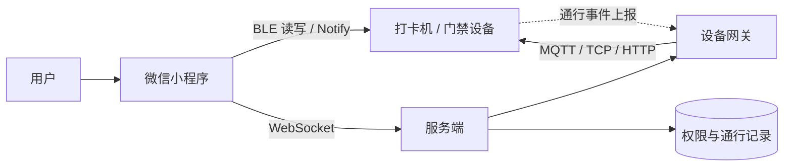
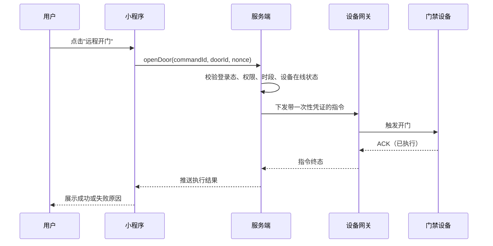
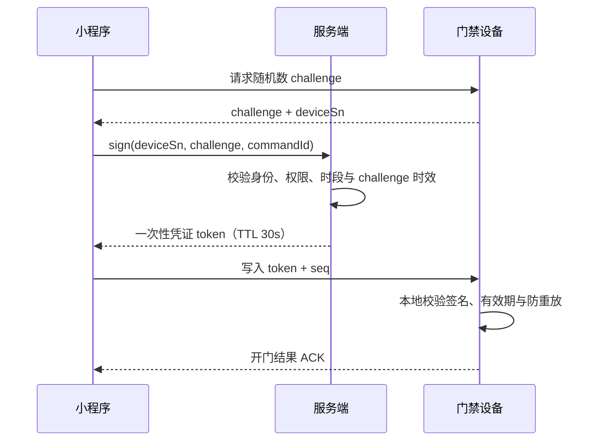
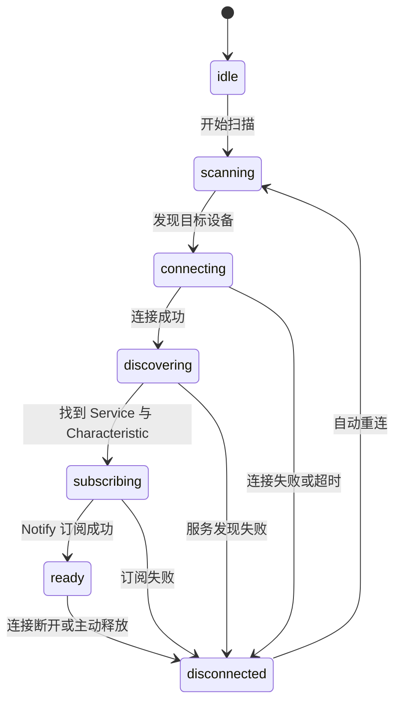

# 微信小程序蓝牙门禁：从 BLE 通信到远程开门的知识地图

“用微信小程序连蓝牙门禁，点一下就能远程开门”——这句话写在简历上只有一行，但它背后其实压着四段协议、两套可靠性模型和一条完整的权限校验链路。面试官如果要深挖，问的不会是“你调过 `wx.createBLEConnection` 吗”，而是“断连时指令怎么办”“设备离线还能不能开门”“怎么防止别人伪造一次开门请求”。

这篇文章不讨论某个具体项目的实现细节，而是把这类需求拆成一张知识地图：从端侧的 BLE 能力，到设备之间的帧协议，再到云端指令下发、通行业务建模、安全设计和可靠性工程。读完之后，你应该能回答一个核心问题——**从用户点击按钮到门锁弹开，这条链路上每一段分别由谁保证正确性**。

## 一、一次开门指令经过了什么

先看整体形态。这类系统通常同时存在两条链路，一条负责“近场”，一条负责“远程”。



近场链路上，小程序直接和设备建立 BLE 连接，完成设备发现、身份确认、指令写入和结果回读。远程链路上，小程序只和服务端通信，由服务端校验权限后把指令交给设备网关，最终触达设备。两条链路解决的是不同问题：

- 近场链路解决“没有网络，但人就在设备旁边”的场景，例如办公楼里没信号的门禁点。
- 远程链路解决“人不在现场”或“设备在另一个网络里”的场景，例如远程给访客开门、下发临时权限。

把这两条链路放在一起，难点就浮现出来了：

1. **传输不可靠**。蓝牙会断，WebSocket 会掉，移动网络会抖动，指令可能重复、乱序、超时。
2. **业务有权限**。能连上设备不等于有资格开门，物理接近不能代替身份与权限校验。
3. **设备会离线**。设备断网时如果完全依赖云端判定，门禁就会变成“网络一断，全员进不去”。

后面的章节基本就在回答这三个问题。反过来，如果面试时你能主动说出这三条，并把它们对应到具体设计，已经比只描述 API 调用高出不止一个层次。

## 二、微信小程序 BLE 能力

### BLE 是什么，小程序能做什么

BLE（Bluetooth Low Energy）是蓝牙 4.0 之后引入的低功耗规范。它和“经典蓝牙”（常用于音频设备）最大的区别是：BLE 面向小数据量、低频次、低功耗的交互，采用 GATT（Generic Attribute Profile）的数据组织方式。

小程序只支持 BLE，不支持经典蓝牙。这意味着如果打卡机是双模设备，你也只能走 BLE 那条通道。

### 完整的 API 调用链

一条完整的设备通信流程大致是固定的：

1. `wx.openBluetoothAdapter`：初始化蓝牙适配器，失败通常意味着用户没开蓝牙或系统版本不支持。
2. `wx.startBluetoothDevicesDiscovery`：开始扫描，`allowDuplicatesKey: true` 才能持续收到同一个设备的 RSSI 更新。
3. `wx.onBluetoothDeviceFound`：拿到设备列表，包含 `deviceId`、`name`、`RSSI`、广播数据等。
4. `wx.createBLEConnection`：连接目标设备。
5. `wx.getBLEDeviceServices` → `wx.getBLEDeviceCharacteristics`：枚举服务与特征值。
6. `wx.notifyBLECharacteristicValueChange` + `wx.onBLECharacteristicValueChange`：订阅通知通道，接收设备主动上报的数据。
7. `wx.writeBLECharacteristicValue`：向可写特征值写入指令。
8. 收尾：`wx.stopBluetoothDevicesDiscovery`、`wx.closeBLEConnection`、`wx.closeBluetoothAdapter`。

### 平台差异才是真正的坑

API 名字是统一的，行为却不是。这些差异几乎每个项目都会踩：

- **Android 扫描需要定位权限**。微信需要 `scope.userLocation` 授权，同时系统定位开关必须打开，否则扫描结果为空且不一定明确报错。Android 12 之后系统还引入了“附近设备”权限，用户拒绝后同样扫不到。
- **iOS 拿不到 MAC 地址**。`deviceId` 在 iOS 上是系统生成的随机 UUID，重装微信、换机或系统重置后可能变化。因此**设备绑定必须依赖业务侧的设备序列号**，`deviceId` 只能作为当前会话的临时标识。
- **单次写入长度受 MTU 限制**。BLE 默认 MTU 为 23 字节，去掉 3 字节 ATT 头，有效载荷只有 20 字节。`wx.setBLEMTU` 可以协商更大的 MTU，但**只在 Android 生效**；iOS 由系统协商，实际可写长度更大却没有统一保证。稳妥的做法是在协议层统一按 20 字节分包，收到协商结果后再按 `mtu - 3` 调整。
- **并发连接数有限**。系统对 BLE 连接数有上限，小程序侧同时连接多个设备容易出现连接失败或互相干扰，通常要串行处理。
- **后台与生命周期会中断连接**。切后台、息屏、页面卸载都可能断开连接，页面 `onHide`/`onUnload` 必须主动释放资源，否则会出现“设备已被占用”这类玄学问题。

### 把回调 API 封装成可等待的 Promise

小程序蓝牙 API 全是回调风格，直接嵌套会写出难以维护的流程。第一步一定是统一封装，并带上超时和错误码映射。

```ts
interface WxCallOptions<T> {
  success: (result: T) => void;
  fail: (error: { errCode?: number; errMsg?: string }) => void;
  [key: string]: unknown;
}

export class BleError extends Error {
  constructor(
    readonly code: number | string,
    message: string,
  ) {
    super(message);
    this.name = "BleError";
  }
}

const BLE_ERROR_MESSAGE: Record<number, string> = {
  10000: "蓝牙适配器未初始化",
  10001: "当前蓝牙适配器不可用",
  10002: "没有找到指定设备",
  10003: "连接失败",
  10004: "没有找到指定服务",
  10005: "没有找到指定特征值",
  10006: "当前连接已断开",
  10007: "当前特征值不支持此操作",
  10008: "系统上报错误",
  10012: "连接超时",
  10013: "deviceId 为空",
};

export function callWx<T>(
  api: (options: WxCallOptions<T>) => void,
  options: Record<string, unknown>,
  timeout = 10_000,
): Promise<T> {
  return new Promise<T>((resolve, reject) => {
    const timer = setTimeout(() => {
      reject(new BleError("TIMEOUT", "蓝牙操作超时"));
    }, timeout);

    api({
      ...options,
      success: (result: T) => {
        clearTimeout(timer);
        resolve(result);
      },
      fail: (error) => {
        clearTimeout(timer);
        const code = error.errCode ?? -1;
        reject(new BleError(code, BLE_ERROR_MESSAGE[code] ?? error.errMsg ?? "蓝牙操作失败"));
      },
    });
  });
}
```

有了这层封装，业务流程才能写成可读的串行代码，也才能在每一步做重试与降级：

```ts
export async function connectDevice(deviceId: string, profile: DeviceProfile) {
  await callWx(wx.createBLEConnection, { deviceId, timeout: 10_000 });

  const { services } = await callWx<{ services: BleService[] }>(wx.getBLEDeviceServices, {
    deviceId,
  });
  const service = services.find((item) => item.uuid === profile.serviceId);
  if (!service) throw new BleError(10004, "目标服务不存在");

  const { characteristics } = await callWx<{ characteristics: BleCharacteristic[] }>(
    wx.getBLEDeviceCharacteristics,
    { deviceId, serviceId: service.uuid },
  );
  const notifyChar = characteristics.find((item) => item.uuid === profile.notifyId);
  const writeChar = characteristics.find((item) => item.uuid === profile.writeId);
  if (!notifyChar || !writeChar) throw new BleError(10005, "通信特征值缺失");

  await callWx(wx.notifyBLECharacteristicValueChange, {
    state: true,
    deviceId,
    serviceId: service.uuid,
    characteristicId: notifyChar.uuid,
  });

  return { deviceId, serviceId: service.uuid, notifyId: notifyChar.uuid, writeId: writeChar.uuid };
}
```

这段代码里有几个容易被忽略但值得指出的设计：

- 服务的 UUID 来自“设备型号资料”（`profile`），而不是写死在业务流程里，方便一个系统支持多种门禁机型。
- 每一步都可能有独立的失败原因，错误码要能映射到用户可理解的提示，否则用户只会看到“操作失败”。
- 特征值角色（哪条用于写、哪条用于通知）属于协议约定，应该作为配置而不是散落在代码里的魔法字符串。

## 三、蓝牙协议与帧协议设计

### GATT 只是承载体

GATT 规定了数据住在哪里：Service 下面挂 Characteristic，每个 Characteristic 有自己的 UUID、读写权限和通知能力。BLE 单个数据包很小，所以应用层协议必须自己解决“消息边界在哪里”的问题。这就是自定义帧协议存在的原因。

### 设计一个够用的帧格式

一个常见的帧结构如下：

| 字段         | 长度       | 说明                                     |
| ------------ | ---------- | ---------------------------------------- |
| 帧头 SOF     | 2 字节     | 固定魔数，例如 `0xA5 0x5A`，用于定位起点 |
| 版本 VER     | 1 字节     | 协议版本，为灰度与兼容留出空间           |
| 指令 CMD     | 1 字节     | 命令码，可用高位区分请求与应答           |
| 序列号 SEQ   | 2 字节     | 请求与应答配对，发送方自增               |
| 长度 LEN     | 1 字节     | 载荷字节数                               |
| 载荷 PAYLOAD | 0–251 字节 | 定长结构体或 TLV 编码                    |
| 校验 CRC16   | 2 字节     | 覆盖版本到载荷，用于发现传输错误         |

这里有几个约定值得解释：

- **帧头不是随机选的**。它要在二进制流里具备足够的辨识度，避免与载荷内容混淆。
- **长度字段决定了重组逻辑**。接收方先读头部，再按长度等待剩余字节，这就是“分包与粘包”的标准解法。BLE 的 Notify 回调不保证一次回调对应一个完整业务包，可能拆开，也可能合并。
- **序列号同时服务于配对、去重和防重放**。请求带 SEQ，应答携带相同 SEQ；发送方维护一个待确认表，超时未确认就重传。
- **CRC 用于发现错误，不用于安全**。校验和能挡住偶然的位翻转，挡不住人为构造的数据。

载荷的编码方式常见两种：定长结构体简单高效，但扩展性差；TLV（Type-Length-Value）扩展性好，解析逻辑稍微复杂。涉及多种设备型号时，TLV 通常更省事。

### 编解码与分包重组

下面是一份可以直接改写复用的编解码实现：

```ts
const FRAME_HEAD = 0xa55a;
const HEADER_SIZE = 7; // SOF(2) + VER(1) + CMD(1) + SEQ(2) + LEN(1)
const CRC_SIZE = 2;

export interface BleFrame {
  cmd: number;
  seq: number;
  payload: Uint8Array;
}

export function crc16(bytes: Uint8Array): number {
  let crc = 0xffff;
  for (const byte of bytes) {
    crc ^= byte;
    for (let bit = 0; bit < 8; bit += 1) {
      crc = (crc & 1) !== 0 ? (crc >> 1) ^ 0xa001 : crc >> 1;
    }
  }
  return crc;
}

export function encodeFrame(frame: BleFrame, version = 1): Uint8Array {
  const { cmd, seq, payload } = frame;
  const buffer = new Uint8Array(HEADER_SIZE + payload.length + CRC_SIZE);
  const view = new DataView(buffer.buffer);

  view.setUint16(0, FRAME_HEAD);
  view.setUint8(2, version);
  view.setUint8(3, cmd);
  view.setUint16(4, seq);
  view.setUint8(6, payload.length);
  buffer.set(payload, HEADER_SIZE);
  view.setUint16(
    HEADER_SIZE + payload.length,
    crc16(buffer.subarray(0, HEADER_SIZE + payload.length)),
  );

  return buffer;
}

export class FrameDecoder {
  private buffer = new Uint8Array(0);

  push(chunk: ArrayBuffer): BleFrame[] {
    this.buffer = concat(this.buffer, new Uint8Array(chunk));
    const frames: BleFrame[] = [];

    while (this.buffer.length >= HEADER_SIZE + CRC_SIZE) {
      const view = new DataView(this.buffer.buffer, this.buffer.byteOffset, this.buffer.byteLength);
      if (view.getUint16(0) !== FRAME_HEAD) {
        this.buffer = this.buffer.subarray(1);
        continue;
      }

      const length = view.getUint8(6);
      const total = HEADER_SIZE + length + CRC_SIZE;
      if (this.buffer.length < total) break;

      const raw = this.buffer.subarray(0, total);
      const expected = view.getUint16(HEADER_SIZE + length);
      if (crc16(raw.subarray(0, HEADER_SIZE + length)) !== expected) {
        this.buffer = this.buffer.subarray(total);
        continue;
      }

      frames.push({
        cmd: view.getUint8(3),
        seq: view.getUint16(4),
        payload: raw.slice(HEADER_SIZE, HEADER_SIZE + length),
      });
      this.buffer = this.buffer.subarray(total);
    }

    return frames;
  }
}

export function concat(left: Uint8Array, right: Uint8Array): Uint8Array {
  const merged = new Uint8Array(left.length + right.length);
  merged.set(left);
  merged.set(right, left.length);
  return merged;
}
```

发送端则要把一个大帧切成多个 BLE 包：

```ts
const DEFAULT_CHUNK_SIZE = 20;

export async function writeFrame(session: BleSession, frame: BleFrame): Promise<void> {
  const bytes = encodeFrame(frame);

  for (let offset = 0; offset < bytes.length; offset += DEFAULT_CHUNK_SIZE) {
    const chunk = bytes.slice(offset, offset + DEFAULT_CHUNK_SIZE);
    await callWx(wx.writeBLECharacteristicValue, {
      deviceId: session.deviceId,
      serviceId: session.serviceId,
      characteristicId: session.writeId,
      value: chunk.buffer,
    });
    // Android 连续写入容易丢包，按平台留出间隔；iOS 一般不需要
    if (isAndroid()) await delay(20);
  }
}
```

一个实用的经验是：**不要把“一次 `write` 成功”当成“设备收到了完整指令”**。BLE 的写成功只代表数据交给了协议栈。真正的业务确认必须来自设备侧的应答帧，这也是下面可靠传输机制存在的原因。

### 可靠传输：序列号、确认与重传

BLE 本身提供了链路层的重传，但连接断开、写入中断、设备离线这些情况仍然需要应用层兜底。常见做法是：

1. 发送方为每个请求分配自增 SEQ，并写入待确认表。
2. 接收方处理成功后，用相同 SEQ 回一个应答帧。
3. 发送方在超时时间内未收到应答，按退避策略重传，超过次数上限后判定失败。
4. 接收方维护一个已处理 SEQ 的滑动窗口，重复的 SEQ 直接返回上次结果，避免“重传导致重复开门”。
5. 长时间空闲时发心跳帧，既保活也能更快发现假连接。

## 四、WebSocket 与云端指令下发

### 一次远程开门的完整时序

远程开门不是“小程序直接命令设备”，而是“小程序请求服务端，服务端审核后再命令设备”。



这张图里有两个关键设计：**前端生成的 `commandId`** 用于幂等，**服务端下发的一次性凭证**用于授权。二者作用完全不同，不能混为一谈。

### 长连接的稳定性

WebSocket 的工程问题集中在“它随时会断”这件事上。一个够用的客户端至少要有：

- **心跳保活**：定时发送 ping，超过若干周期没有 pong 就判定连接已死并主动重建。
- **指数退避重连**：失败后延迟重连，延迟随失败次数增长并加随机抖动，避免服务端重启时所有客户端同时冲击。
- **业务幂等**：重连后重发未确认的指令，服务端按 `commandId` 去重。
- **离线补偿**：重连成功时先拉取断线期间的指令结果，而不是假设消息一定推送到了。

```ts
type SocketState = "connecting" | "open" | "closed" | "reconnecting";

interface SocketOptions {
  url: string;
  onMessage: (data: string) => void;
  onStateChange: (state: SocketState) => void;
}

export class ReconnectingSocket {
  private socket?: WechatMiniprogram.SocketTask;
  private attempts = 0;
  private heartbeatTimer?: ReturnType<typeof setInterval>;
  private pongTimer?: ReturnType<typeof setTimeout>;

  constructor(private readonly options: SocketOptions) {}

  connect(): void {
    this.options.onStateChange(this.attempts === 0 ? "connecting" : "reconnecting");
    const socket = wx.connectSocket({ url: this.options.url });
    this.socket = socket;

    socket.onOpen(() => {
      this.attempts = 0;
      this.options.onStateChange("open");
      this.startHeartbeat();
    });

    socket.onMessage((event) => {
      if (event.data === "pong") {
        clearTimeout(this.pongTimer);
        return;
      }
      this.options.onMessage(String(event.data));
    });

    socket.onClose(() => this.scheduleReconnect());
    socket.onError(() => this.scheduleReconnect());
  }

  private startHeartbeat(): void {
    this.heartbeatTimer = setInterval(() => {
      this.socket?.send({ data: "ping" });
      this.pongTimer = setTimeout(() => this.socket?.close({}), 5_000);
    }, 20_000);
  }

  private scheduleReconnect(): void {
    clearInterval(this.heartbeatTimer);
    clearTimeout(this.pongTimer);
    this.options.onStateChange("closed");

    const base = Math.min(30_000, 1_000 * 2 ** this.attempts);
    const delay = base / 2 + Math.random() * (base / 2);
    this.attempts += 1;
    setTimeout(() => this.connect(), delay);
  }
}
```

### 消息语义与顺序

除了连接本身，消息层面还有几件事要明确：

- **幂等**：同一条指令可能被重发多次，服务端必须按指令 ID 去重，并把首次执行结果作为最终结果返回。
- **顺序**：同一个设备上的指令必须串行。“开门”和“下发权限”如果并发，设备可能只执行了一条。前端侧可以用按设备分组的串行队列来保证。
- **状态同步**：指令至少有“已下发”“执行中”“已执行”“失败”“已过期”这些状态，前端不能只用一个布尔值表示结果。
- **降级**：WebSocket 不可用时，能否退回 BLE 直连或短轮询，取决于业务是否允许“晚一点的开门”。这类降级策略要提前定义，而不是等线上出问题再临时决定。

### 小程序侧的限制

- WebSocket 必须使用 `wss`，域名需要在微信后台配置为 socket 合法域名。
- 小程序同时存在的 WebSocket 连接数有上限（历史上是 5 个），不要为每个页面各开一条。
- 切后台后长连接可能被系统中断，回到前台需要显式检测并重建。

如果服务端到设备这一段采用 MQTT，通常是合理的：设备端有成熟的客户端库，天然支持订阅、遗嘱消息和 QoS。但要注意，**小程序侧几乎不会直接使用 MQTT**，它只是云端到设备段的协议选择，小程序到云端这一段仍然用 WebSocket 或 HTTP。

## 五、为什么不让前端直接开门

读到这里很容易产生一个疑问：既然小程序已经连上蓝牙了，让它直接给设备写一条开门指令不是更快吗，为什么还要绕一圈服务端？

“云端开门”确实是很多门禁系统的默认做法，但它解决的**不是“前端发指令”这件事本身，而是“把长期密钥交给客户端”这件事**。把这两者分开看，这个架构选择才说得清。

### 前端直连设备的真实风险

如果前端直接下发开门命令，这条命令必须能被设备验证为合法。验证方式无非两种：

- 设备预置一个长期密钥，前端携带密钥或用密钥签名。
- 设备本地维护白名单，前端携带身份标识。

两种方式都把**可长期复用的凭据放到了客户端**。小程序代码可以被反编译，运行时内存可以被读取，通信内容可能被抓包（尤其在对 BLE 链路加密不可靠的机型上）。一旦这份凭据泄漏，攻击者不需要你的手机，就能在任何地方构造合法请求。

真正的问题还不是“前端发了指令”，而是：**前端一旦持有可复用的长期凭据，权限回收就失效了**。吊销设备密钥意味着全量刷固件，吊销人员权限意味着逐台设备更新白名单。这在小规模时能忍，规模一大就是运维灾难。

### 云端开门的前提：设备自己联网

云端下发有一个物理前提：设备必须自己能联网。它需要有 4G 模组、以太网口，或者通过本地网关接入服务端。满足这个条件时，小程序只负责调用自己的后端接口，开门指令由服务端经设备网关送达。

如果不满足——比如老楼里的门禁点没有网线也没有信号——那唯一的通道就是手机的蓝牙链路，此时“前端不向设备发送任何数据”在物理上不可能实现。能做的只是把前端搬运的东西从“开门命令”降级为**服务端签发的短时效一次性凭证**，设备本地验签后才执行。前端依然不掌握密钥，但它确实在传输数据。

### 三种模型对比

| 模型         | 前端角色                 | 优点                               | 代价                           |
| ------------ | ------------------------ | ---------------------------------- | ------------------------------ |
| 纯 BLE 开门  | 携带凭证并写入设备       | 无网可用，延迟低                   | 密钥或白名单在设备侧，升级困难 |
| 纯云端开门   | 只调后端接口             | 密钥不出客户端，权限集中，审计完整 | 依赖网络，服务端成为关键路径   |
| 混合（推荐） | 平常调后端，断网时走 BLE | 兼顾安全与可用性                   | 实现复杂度最高                 |

混合模型的分工是：正常情况走云端下发加设备验签；弱网或断网时降级为 BLE 写入短时效凭证；两条路径共用同一套凭证格式、有效期规则和防重放字段，避免维护两套安全实现。

### BLE 连接在云端模型里还有什么价值

必须承认一点：**“连上了蓝牙”本身几乎不构成授权依据**。BLE 链路可以被中继放大，`deviceId` 在 iOS 上还是随机值，服务端无法凭它证明用户真的站在设备面前。把它当作安全因子，等于用一把随时能配的钥匙当门锁。

它有价值的用法有三个：

1. **体验辅助**：靠近设备时自动展示对应的门禁入口，减少用户选择成本。
2. **弱接近提示**：结合 RSSI 与超时做 UI 提示，但明确不作为放行条件。
3. **搬运设备签名**：设备生成随机挑战值并用自己的私钥签名，前端把这个签名转给服务端，服务端用设备公钥验签后再下发开门指令。

第三种是唯一能让“蓝牙连接”具备安全意义的方式，但它要求设备侧具备密钥与签名能力。注意此时前端做的仍然是**搬运设备的签名，而不是下发开门命令**——授权依旧由服务端签发。

### 断网时必须留的退路

纯云端方案最大的代价是可用性：手机没信号、网关掉线、服务端发布异常，都会直接表现为“所有人进不去”。门禁是高频且刚需的场景，这个代价通常不能接受，所以云端开门方案一般都要配离线兜底：

- 设备本地保存权限白名单与有效期规则，断网时按本地数据判定。
- 权限下发使用全量加增量结合，全量纠错，增量降延迟。
- 通行记录缓存在设备本地，恢复联网后补传并按记录 ID 去重。

这套机制的代价是权限变更存在同步延迟。安全要求高的场所会缩短本地凭证 TTL，要求设备保持在线，或者对高权限门禁点强制走云端。

### 怎么选

- 设备可联网、安全等级高、能接受秒级延迟：走云端下发。
- 设备不可联网、要求离线可用、早晚高峰客流集中：必须保留 BLE 本地凭证。
- 真实系统大多落在中间：**以云端下发为主，BLE 凭证为降级路径**，两条路径共享同一套凭证与校验规则。

最后别忘了工程量。云端开门会把服务端从“记录系统”变成“控制系统”，开门失败率、P95 延迟、网关在线率、限流与审计告警都要按关键路径的标准来做。安全提升不是免费的，它换来的是一组新的可用性责任。

面试里被问到这个问题，一句可用的回答是：**“前端不直接下发开门指令，只负责发起请求和搬运设备签名；授权由服务端签发，设备侧再做一次本地验签，长期密钥不下发到客户端。”** 对方如果接着问“设备不联网怎么办”，就顺势补上离线白名单与一次性凭证的兜底方案——只答前半句，这个设计在真实门禁场景里是站不住的。

## 六、门禁、打卡与访客业务建模

技术链路之外，通行业务本身也有它自己的模型。把这些概念理清楚，才可能在面试里说清“你做的到底是什么”。

### 凭证类型与适用场景

| 凭证类型 | 优点                         | 局限                           |
| -------- | ---------------------------- | ------------------------------ |
| 蓝牙     | 小程序原生能力，无需额外硬件 | 依赖蓝牙开关与权限，距离受限   |
| 二维码   | 实现最简单，成本低           | 可截图转发，需要动态刷新与校验 |
| NFC      | 体验快，接近即刷             | iOS 小程序能力受限，依赖硬件   |
| IC 卡    | 稳定、普及、离线可用         | 容易代刷、需要发卡与挂失流程   |
| 人脸     | 无感通行、防代刷             | 成本高，涉及生物信息合规       |

蓝牙方案的价值通常在于“用手机替代实体卡”，并且能在没有网络的场景下完成近场校验。

### 权限模型

门禁权限的本质是一组多对多关系：**人员 × 门禁点 × 时间规则**。同一个门禁点对不同人有不同时段，同一个人对不同门禁点也有不同权限。这可以用 RBAC 的“角色聚合权限”思路实现，也可以用 ABAC 按属性（部门、楼层、有效期、访客来源）动态判定。

落到数据结构上，一般是“权限规则表 + 设备白名单下发”。规则表在服务端维护，白名单是规则在某台设备上的物化结果。

### 访客限时通行

访客场景比员工通行多几层约束：

- 有效期：`validFrom` 与 `validTo`，且通常精确到分钟。
- 次数限制：单次、多次或按天重置。
- 通行范围：只能进被访人所在楼层或指定门禁点。
- 审批链路：被访人确认、前台登记或后台审批。
- 撤销能力：访客提前离场时权限应能立即失效，这一点要求设备侧能及时同步，或者依赖较短的凭证 TTL。

### 设备离线怎么办

这是门禁系统最容易被问到的设计题。答案通常是“边缘校验 + 云端同步”：

- 设备本地保存一份权限白名单和有效期规则，断网时按本地数据判定。
- 云端下发权限时使用**全量 + 增量**结合：全量用于纠错，增量用于降低延迟。
- 设备把通行记录缓存在本地，恢复联网后补传，服务端按记录 ID 去重。
- 白名单容量有限时，按时间窗口裁剪，避免设备存储被撑满。

这套机制的代价是权限变更存在同步延迟，所以安全要求高的场所会缩短白名单的有效期，或者要求设备保持在线。

### 事件与审计

门禁系统产生的数据远不止“开门成功”：

- 通行记录：谁、什么时候、走哪个门禁点、用什么凭证、结果如何。
- 异常事件：多次验证失败、门长时间未关、设备离线、强制开门。
- 审计日志：谁给谁开了远程门、谁改了权限、变更前后是什么。

审计日志是远程开门功能的必要配套——正因为前端可以触发一个物理动作，才更需要留下可追查的记录。

## 七、安全设计

### 蓝牙通道不该传“开门”明文

最危险的设计是在 BLE 通道里直接写一个 `OPEN` 命令，设备收到就开门。这样只要有人能连上设备，就能开门。正确的做法是让蓝牙通道只承载**一次性通行凭证**：小程序向服务端申请一个短时效、绑定设备与人的 token，设备本地校验 token 的签名、有效期和状态后才执行动作。

### 防重放

一次性凭证必须能抵抗重放攻击，也就是“把别人刚才发过的合法数据原样再发一次”。常见组合是：

- **时间戳**：超出允许窗口直接拒绝，同时要求设备与服务器时间大致同步。
- **nonce**：每次请求随机生成，服务端与设备侧记录已使用过的值。
- **序列号**：单调递增，设备维护期望值，小于等于已处理值的请求直接丢弃。
- **指令 ID**：用于业务幂等，重复指令返回首次执行结果，而不是再开一次门。



### 加密与密钥

- 传输层：优先依赖 BLE 链路加密与 `wss`，但不要把它们当作唯一防线。
- 应用层：对关键字段做签名或加密，算法可以是 AES-GCM、RSA 或国密套件，具体取决于硬件能力与合规要求。
- 密钥管理：设备出厂预置密钥、按设备派生密钥、或者每次会话协商临时密钥。**密钥绝不能出现在小程序代码里**，前端只能持有短期凭证。

### 权限判定必须在服务端

前端做的一切——UI 置灰、按钮隐藏、状态检查——都只是体验优化。真正的权限判定必须在服务端完成，包括“这个人有没有这个门的权限”“当前是否在有效时段内”“该设备是否在线”。设备侧再做一次本地校验，形成纵深防御。

### RSSI 不是安全边界

“靠近设备才能开门”听起来合理，但 RSSI 很容易被放大或中继，不能作为强安全边界。它最多用于 UX 辅助，例如筛选附近的设备、提示用户靠近。真正决定能否开门的应该是签名凭证与权限校验。

## 八、可靠性与前端工程化

### 用状态机约束连接流程

蓝牙连接过程有明确的阶段，用状态机管理比散落的布尔标志可靠得多。



```ts
export type BleLinkState =
  "idle" | "scanning" | "connecting" | "discovering" | "subscribing" | "ready" | "disconnected";

export const ALLOWED_TRANSITIONS: Record<BleLinkState, readonly BleLinkState[]> = {
  idle: ["scanning"],
  scanning: ["connecting", "idle"],
  connecting: ["discovering", "disconnected"],
  discovering: ["subscribing", "disconnected"],
  subscribing: ["ready", "disconnected"],
  ready: ["disconnected"],
  disconnected: ["scanning", "idle"],
};

export function canTransit(from: BleLinkState, to: BleLinkState): boolean {
  return ALLOWED_TRANSITIONS[from].includes(to);
}
```

状态机带来的收益是：非法跳转会被立刻发现，“正在连接时又点了扫描”这类并发问题在开发阶段就暴露，而不是变成线上偶现故障。

### 幂等、重试与队列

把指令设计成带唯一 ID 的数据结构，前端与服务端可以共享同一套幂等语义：

```ts
export interface CommandRequest {
  commandId: string; // 前端生成，服务端按此去重
  deviceId: string;
  action: "open" | "close" | "sync";
  issuedAt: number;
  nonce: string;
}
```

配套的规则是：

- 同一设备的指令进入串行队列，前一条拿到终态后才发下一条。
- 超时重试沿用同一个 `commandId`，而不是生成新 ID。
- 重试次数和总时长都要有上限，超限后进入人工介入或兜底通道。
- 失败原因分层：连接失败、写入失败、设备拒绝、权限过期、超时，提示语各不相同。

### 值得埋的指标

门禁这类系统“能跑通”和“可靠”之间差的就是这些指标：

| 指标             | 说明                                   |
| ---------------- | -------------------------------------- |
| 连接成功率       | 按机型、系统版本、Android/iOS 分组对比 |
| 指令下发成功率   | 区分 WebSocket 通道与 BLE 直连通道     |
| 端到端耗时 P95   | 从点击到收到终态，比平均值更有诊断价值 |
| 错误码分布       | 定位是权限问题、连接问题还是设备问题   |
| 重连次数与耗时   | 反映网络质量与客户端重连策略是否合理   |
| 离线补传记录条数 | 衡量设备离线时长与同步压力             |

### 测试与兼容性

BLE 代码没法只靠单元测试覆盖，但结构上可以做两件事：

1. **把 BLE 层抽象成接口**（扫描、连接、写入、订阅），业务逻辑只依赖接口。这样协议编解码、状态机、幂等队列都能用 Mock 做单元测试。
2. **维护真机兼容性矩阵**，至少覆盖主流 Android 厂商、不同系统版本与 iOS 版本，重点验证权限、MTU、后台断连和重连行为。

### 降级路径

一条可靠链路的标志是它知道“退路在哪”：

- WebSocket 断开 → 提示用户靠近设备走 BLE 直连。
- BLE 连接失败 → 尝试重新扫描，或引导用户改用二维码凭证。
- 服务端不可达 → 使用有效期内的一次性凭证完成本地校验（如果设备支持）。
- 设备离线 → 把指令排队，恢复后补发，并明确告知用户“会在设备恢复后执行”。

## 九、面试高频追问与答题要点

**1. 为什么用蓝牙，而不是二维码或 NFC？**

小程序对 BLE 的支持最完整；NFC 在 iOS 小程序上能力受限；二维码容易被截图转发。蓝牙方案还能在设备断网时完成近场校验，适合“手机替代实体卡”的场景。同时要承认蓝牙的代价：权限、兼容性和连接稳定性都需要额外处理。

**2. 蓝牙断开时，正在执行的开门指令怎么办？**

区分阶段：指令还没写出去就断，直接判定失败并允许用户重试；已经写出但没收到 ACK，则进入“结果未知”状态，重连后按序列号查询执行结果，而不是盲目重发。未知状态是分布式系统里必须建模的一种状态。

**3. 设备离线还能不能开门？**

能，前提是设备本地有白名单与有效期规则。代价是权限变更存在同步延迟，所以高安全场景会缩短本地凭证 TTL，或要求设备保持在线。

**4. 一次性凭证应该怎么设计？**

要点是：服务端签发、短时效、绑定人员与设备、带 nonce 与序列号、设备侧可本地校验签名与时效、使用后即失效或进入已用集合。凭证里不应包含可直接复用的长期密钥。

**5. Android 和 iOS 上分别踩过什么坑？**

Android 侧主要是定位权限与定时开关、MTU 协商、连续写入需要间隔、机型差异大；iOS 侧主要是 `deviceId` 随机化、无法获取 MAC、系统自动协商 MTU 导致长度行为不一致、后台断连更激进。回答这类问题的关键是说明你用什么办法把差异隔离在适配层里，而不是逐条抱怨平台。

**6. 你和后端、硬件同事的职责边界是什么？**

典型分工是：前端负责设备发现、连接管理、帧编解码与交互体验；后端负责权限校验、指令签发与状态机、审计与监控；硬件或嵌入式负责白名单存储、本地校验、事件上报与离线策略。协议文档由三方共同维护，任何一方改协议都要走版本号。

**7. 怎么防止用户伪造开门请求？**

三层防线：前端只能拿到短期凭证，长期密钥不出现在客户端；服务端做权限与时段校验，并签发一次性 token；设备侧校验签名、时效与防重放字段，再做本地权限判定。

**8. 日均数千次指令，系统压力大吗？**

不大。数千次除以一天大约是 0.06 次每秒的平均量级，真正的峰值通常集中在早晚高峰。这里的难点是可靠性与多机型兼容，而不是高并发。面试时主动说明这一点，并给出峰值、并发连接数和重试比例，比含糊地强调“量很大”更可信。

**9. 接口如何保证不重复开门？**

分层处理：前端为每个动作生成唯一 `commandId`；服务端按 `commandId` 去重并返回首次执行结果；BLE 协议用 SEQ 配对与应答；设备侧维护已处理序列号窗口。四层里任何一层都不能单独承担幂等责任。

**10. 如果让你重新设计，会改什么？**

常见答案包括：把协议版本号从第一天就做进去；把连接状态机与重连策略抽成独立 SDK，避免每个页面重复实现；用统一的错误码体系替代各机型自定义错误；把幂等与“结果未知”状态在接口契约里显式定义。

## 十、这条简历应该怎么写

原始写法通常是功能罗列：

> 基于微信小程序蓝牙 BLE API 实现打卡机、门禁等设备的近场发现与数据交互；结合 WebSocket 与服务端指令下发，支持远程开门及访客限时通行，覆盖打卡、门禁、访客等出入场景。

它在描述“做了什么”，但没有说“难在哪”和“结果如何”。更好的结构是**技术难点 + 你的动作 + 可量化结果**：

> 封装小程序 BLE 连接状态机与分包帧协议，统一 Android/iOS 在权限、MTU 与重连行为上的差异，把设备连接成功率从 X% 提升到 Y%；结合 WebSocket 下发一次性通行凭证，实现远程开门与访客限时通行，端到端 P95 控制在 Z 秒内，并补齐指令幂等与审计日志以支持安全追溯。

改写时最好补上这几类数据：

- 覆盖的设备型号数、门禁点数与用户规模。
- 连接成功率、指令成功率、P95 耗时，以及改造前后的对比。
- 日均指令量与峰值量级，别回避“量不大”这个事实。
- 支持的机型与系统版本范围。
- 你个人负责的模块边界，以及跨端、跨团队协作的具体内容。

## 十一、总结

回到最初的问题：一次开门指令经过了哪些环节？

它先经过小程序的 BLE 适配层，处理权限、扫描、连接、MTU 与分包；再经过帧协议层，处理边界、校验、序列号与重传；然后经过 WebSocket 长连接，处理心跳、重连、幂等与离线补偿；最后经过服务端的权限校验与一次性凭证签发，以及设备侧的本地白名单与防重放校验。

这条链路的知识点很多，但可以用三个问题把它们串起来：

1. **谁排队**——包怎么切分、消息怎么排序、连接怎么重建。
2. **谁校验**——权限、时段、凭证时效、防重放分别在哪儿完成。
3. **谁兜底**——断网、断连、超时、未知结果时系统的退路是什么。

能把这三个问题讲清楚，简历上那一行字才真正有了分量。

## 参考资料

- [微信开放文档：蓝牙低功耗（BLE）](https://developers.weixin.qq.com/miniprogram/dev/api/device/bluetooth-ble/wx.openBluetoothAdapter.html)
- [微信开放文档：WebSocket](https://developers.weixin.qq.com/miniprogram/dev/api/network/websocket/wx.connectSocket.html)
- [Bluetooth Core Specification](https://www.bluetooth.com/specifications/specs/core-specification/)
- [Bluetooth Assigned Numbers](https://www.bluetooth.com/specifications/assigned-numbers/)
- [MDN: WebSocket API](https://developer.mozilla.org/en-US/docs/Web/API/WebSocket)
- [RFC 6455: The WebSocket Protocol](https://datatracker.ietf.org/doc/html/rfc6455)
- [MQTT: MQTT Specification](https://mqtt.org/mqtt-specification/)
