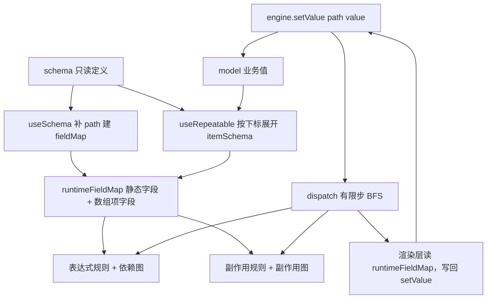
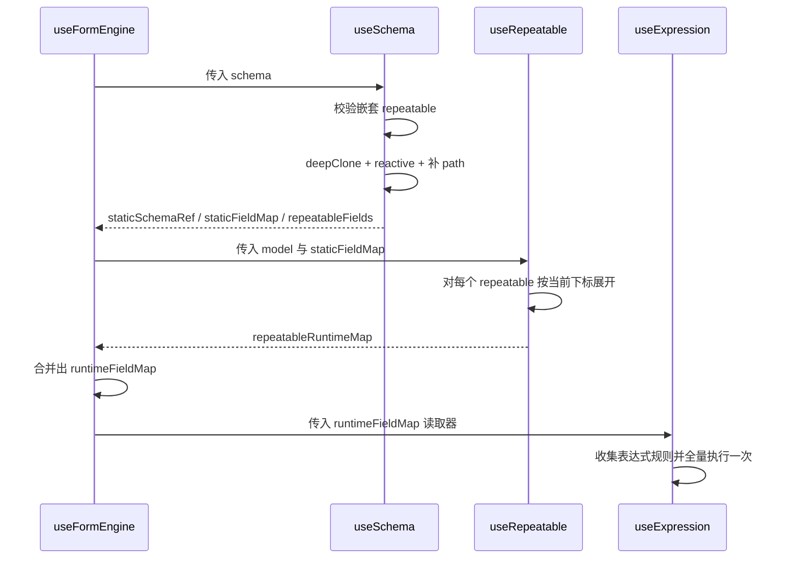
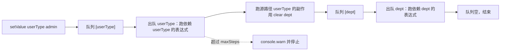
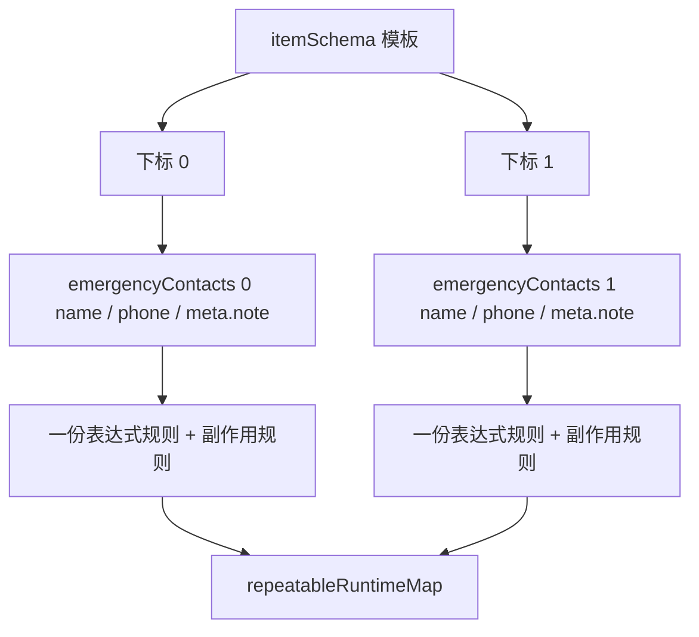

# form-engine 实现导读

> 本文讲的是 `labs/form-engine/src/form-engine/` 的**当前实现**，不是历史草稿。
> 文中代码块是从源码整段抄下来的快照，**以文件路径为准**；改代码时请同步本文。
> 原设计草稿完整归档在 [DESIGN.draft.md](./DESIGN.draft.md)，它不代表现状；运行方式与目录说明见 [README.md](./README.md)。
> 同一主题另有成稿文章 `content/notes/动态表单引擎.md`，那篇走的是更彻底的 runtimeState 拆分方案，本文自包含，不依赖它。

**建议阅读顺序**：先读「一」建立全局印象；想弄清「改一个值到底发生了什么」读「三」；
想弄清数组和下标读「四」；只关心渲染层怎么解耦读「五」；查具体函数行为直接跳到对应小节的代码块。

## 一、全局心智模型

引擎只有三层状态，先记住谁归谁管：

| 层         | 是什么                                                                    | 谁写                       | 放在哪                   |
| ---------- | ------------------------------------------------------------------------- | -------------------------- | ------------------------ |
| schema     | 字段结构：控件名、初始 props、rules、expressions、effects                 | 业务侧编写，引擎只读       | 业务侧自己的文件         |
| model      | 真正要提交、要持久化的业务数据                                            | 只能通过 `engine.setValue` | `engine.model`           |
| 运行时字段 | schema 的响应式副本，表达式的结果写在它的 `props` / `rules` / `custom` 上 | 引擎                       | `engine.runtimeFieldMap` |

引擎内部的基本单位：

| 名词                     | 含义                                                                                           |
| ------------------------ | ---------------------------------------------------------------------------------------------- |
| 静态字段                 | schema 里 `field` / `children` 展开出的字段，`path` 在初始化时算好                             |
| 数组项字段               | repeatable 的 `itemSchema` 按 `下标` 展开出的字段，`path` 运行时生成，例如 `contacts[1].phone` |
| ExpressionEffect         | 一条规则：「哪个字段的哪个目标路径」由「哪段表达式」算                                         |
| SideEffect               | 一条规则：「哪个字段变了」就「清空哪些路径」                                                   |
| 依赖图 DependencyGraph   | `依赖路径 -> 命中哪些 ExpressionEffect`，由规则倒排得到                                        |
| 副作用图 SideEffectGraph | `源路径 -> 命中哪些 SideEffect`                                                                |
| 级联                     | 副作用清空的路径重新入队，继续派发，直到队列空或超过 `maxSteps`                                |

表达式里能用的变量只有五个，它们的可用范围经常被记错：

| 变量         | 含义                                       | 什么时候有值               | 进不进依赖图                       |
| ------------ | ------------------------------------------ | -------------------------- | ---------------------------------- |
| `$model`     | 整个表单数据                               | 永远                       | 进（除非写成动态键 `$model[key]`） |
| `$item`      | 当前数组项对象，等价于 `model.contacts[1]` | 只有数组项字段的表达式才有 | 进，展开成绝对路径                 |
| `$index`     | 当前下标                                   | 同上                       | **不进**                           |
| `$self`      | 当前运行时字段本身                         | 永远                       | **不进**                           |
| `$functions` | `useFormEngine` 注入的函数表               | 永远                       | **不进**（假定纯函数）             |



图 1 要表达的就一件事：**schema 和 model 都只是输入，真正被读写的中间层是 `runtimeFieldMap`**。
渲染层读它、表达式写它、model 反过来只接受 `setValue` 的写入。

## 二、场景一：初始化——从 schema 到运行时字段

初始化做四件事：校验 schema → 生成静态字段 → 按 model 里已有的数组展开数组项字段 → 跑一遍全部表达式。
它**不跑副作用**：副作用代表「值变了之后的清理」，不该清空调用方传进来的 `initialModel`。



### 2.1 静态字段：`useSchema`

> 源码：`src/form-engine/hooks/useSchema.ts`（去掉 import）

```ts
/** v1 不支持嵌套 repeatable：在编译阶段直接报错，避免出现难排查的隐式行为。 */
function assertSchemaSupported(fields: FormField[], insideRepeatable = false): void {
  fields.forEach((field) => {
    const name = field.field ?? "(anonymous)";

    if (field.repeatable) {
      if (insideRepeatable) {
        throw new Error(`[FormEngine] Nested repeatable field "${name}" is not supported.`);
      }

      assertSchemaSupported(field.itemSchema ?? [], true);
    }

    if (field.children?.length) {
      assertSchemaSupported(field.children, insideRepeatable);
    }
  });
}

/**
 * 生成静态字段路径。
 *
 * 普通字段和对象嵌套字段在这里得到 path；repeatable 的 itemSchema 留到运行时按下标展开。
 * 运行时字段用 reactive 包一层，表达式写回 props/rules/custom 之后渲染层才会更新。
 */
function buildStaticFields(fields: FormField[], parentPath = ""): FormField[] {
  return fields.map((field) => {
    const currentPath = joinPath(parentPath, field.field);
    const nextField = reactive<FormField>({ ...deepClone(field), path: currentPath });

    if (field.children?.length) {
      nextField.children = buildStaticFields(field.children, currentPath);
    }

    return nextField;
  });
}

function collectFieldMap(fields: FormField[], map: FieldMap): void {
  fields.forEach((field) => {
    if (field.path) {
      map[field.path] = field;
    }

    if (field.children?.length) {
      collectFieldMap(field.children, map);
    }
  });
}

function collectRepeatableFields(fields: FormField[], result: FormField[]): void {
  fields.forEach((field) => {
    if (field.repeatable) {
      result.push(field);
    }

    if (field.children?.length) {
      collectRepeatableFields(field.children, result);
    }
  });
}

export function useSchema(inputSchema: FormField[]) {
  assertSchemaSupported(inputSchema);

  /** 静态 schema：path 已初始化。 */
  const staticSchemaRef = shallowRef<FormField[]>(buildStaticFields(inputSchema));

  const staticFieldMap = computed<FieldMap>(() => {
    const map: FieldMap = {};
    collectFieldMap(staticSchemaRef.value, map);
    return map;
  });

  const repeatableFields = computed<FormField[]>(() => {
    const result: FormField[] = [];
    collectRepeatableFields(staticSchemaRef.value, result);
    return result;
  });

  return {
    staticSchemaRef,
    staticFieldMap,
    repeatableFields,
  };
}
```

读法，按调用顺序：

- `assertSchemaSupported` 只做一件事：发现「repeatable 套 repeatable」就直接抛。放在初始化而不是运行时，是为了让错误在启动时就炸出来，而不是等用户点开某一项。
- `buildStaticFields` 递归补 `path`。三个动作：`deepClone(field)` 切断与源 schema 的联系、`reactive(...)` 让表达式写回能被渲染层感知、`joinPath` 拼出 `contact.address.city` 这样的路径。
- `collectFieldMap` 把所有有 `path` 的字段塞进一张扁平表，key 就是路径。后面的表达式、副作用、渲染全都靠这张表按路径查字段。
- `collectRepeatableFields` 只挑出 repeatable 容器，供初始化时逐个展开。

最容易绕的一点：**字段的 `path` 不是 schema 作者写的**，而是这里算出来的；
`deepClone` + `reactive` 这一步同时解释了「为什么源 schema 不会被污染」和「为什么表达式改 `props` 后界面会更新」。

### 2.2 数组项字段：按下标展开

repeatable 的 `itemSchema` 只是一份模板，初始化时要按 model 里已有的数组长度展开成 N 份字段。

> 源码：`src/form-engine/hooks/useRepeatable.ts`（本小节的三个函数；同文件其余函数见「四、场景三」）

```ts
/** 展开对象嵌套字段，path 以父路径为前缀。 */
function buildRuntimeChildren(children: FormField[], parentPath: string): FormField[] {
  return children.map((child) => {
    const currentPath = child.field ? `${parentPath}.${child.field}` : parentPath;
    const nextField = reactive<FormField>({ ...deepClone(child), path: currentPath });

    if (child.children?.length) {
      nextField.children = buildRuntimeChildren(child.children, currentPath);
    }

    return nextField;
  });
}

/** 根据 itemSchema 和下标生成数组项的运行时字段。 */
function buildRuntimeItemFields(
  itemSchema: FormField[],
  arrayPath: string,
  index: number,
): FormField[] {
  return itemSchema.map((field) => {
    const currentPath = field.field
      ? `${arrayPath}[${index}].${field.field}`
      : `${arrayPath}[${index}]`;
    const nextField = reactive<FormField>({ ...deepClone(field), path: currentPath });

    if (field.children?.length) {
      nextField.children = buildRuntimeChildren(field.children, currentPath);
    }

    return nextField;
  });
}

/** 根据 itemSchema 生成默认数组项数据。 */
function createDefaultItem(itemSchema: FormField[]): Record<string, any> {
  const item: Record<string, any> = {};

  itemSchema.forEach((field) => {
    if (!field.field) return;

    if (field.children?.length) {
      item[field.field] = createDefaultItem(field.children);
    } else if (field.repeatable) {
      item[field.field] = [];
    } else {
      item[field.field] = undefined;
    }
  });

  return item;
}
```

读法：

- `buildRuntimeItemFields` 决定「一份模板 × 一个下标 = 一组字段」。`emergencyContacts` 的第 1 项会把 `name` 变成 `emergencyContacts[1].name`。
- 数组项里如果还有对象嵌套，交给 `buildRuntimeChildren` 继续拼：`meta` 里的 `note` 会得到 `emergencyContacts[1].meta.note`。
- `createDefaultItem` 是 `append` 时的数据模板：对象嵌套给对象、嵌套 repeatable 给空数组、叶子字段给 `undefined`（这样字段会出现在 model 里，但不会被当成有值）。

这里就能回答「数组里怎么访问某一项」：**itemSchema 里只写字段名，绝对路径由这里生成**；
表达式里要用绝对路径时写 `$model.emergencyContacts[1].name`，要写「当前这一项」则用 `$item.name`。

### 2.3 总装：`useFormEngine`

初始化阶段的所有零件都在这个函数里串起来，建议对着代码里的注释编号 1–5 读。

> 源码：`src/form-engine/hooks/useFormEngine.ts`（去掉 import）

```ts
export function useFormEngine(options: FormEngineOptions): FormEngine {
  const maxSteps = options.maxSteps ?? 100;
  const model = reactive<FormModel>(options.initialModel ? deepClone(options.initialModel) : {});
  const functions = options.functions ?? {};

  /** 1. 静态 schema 初始化。 */
  const { staticSchemaRef, staticFieldMap, repeatableFields } = useSchema(options.schema);

  /** 2. repeatable 运行时层。 */
  const { repeatableRuntimeMap, rebuildRepeatableRuntime, addArrayItem, removeArrayItem } =
    useRepeatable({
      model,
      staticFieldMap: () => staticFieldMap.value,
    });

  /** 3. 运行时字段 = 静态字段 + repeatable 数组项实例字段。 */
  const runtimeFieldMap = computed<FieldMap>(() => {
    const merged: FieldMap = { ...staticFieldMap.value };

    Object.values(repeatableRuntimeMap).forEach((runtime) => {
      Object.assign(merged, runtime.itemFieldMap);
    });

    return merged;
  });

  /** 4. expressions。 */
  const {
    createStaticExpressionEffects,
    createDependencyGraph,
    runAllExpressions,
    triggerExpressionsByPath,
  } = useExpression({
    model,
    getRuntimeFieldMap: () => runtimeFieldMap.value,
    functions,
  });

  /** 5. side effects。 */
  const { createStaticSideEffects, createSideEffectGraph, triggerSideEffectsByPath } = useEffects({
    model,
    getRuntimeFieldMap: () => runtimeFieldMap.value,
    functions,
  });

  const staticExpressionEffects = computed<ExpressionEffect[]>(() =>
    createStaticExpressionEffects(staticSchemaRef.value),
  );

  /** 运行时表达式 = 静态 + repeatable。 */
  const runtimeExpressionEffects = computed<ExpressionEffect[]>(() => {
    const merged: ExpressionEffect[] = [...staticExpressionEffects.value];

    Object.values(repeatableRuntimeMap).forEach((runtime) => {
      merged.push(...runtime.itemExpressionEffects);
    });

    return merged;
  });

  const runtimeDependencyGraph = computed<DependencyGraph>(() =>
    createDependencyGraph(runtimeExpressionEffects.value),
  );

  const staticSideEffects = computed<SideEffect[]>(() =>
    createStaticSideEffects(staticSchemaRef.value),
  );

  /** 运行时副作用 = 静态 + repeatable。 */
  const runtimeSideEffects = computed<SideEffect[]>(() => {
    const merged: SideEffect[] = [...staticSideEffects.value];

    Object.values(repeatableRuntimeMap).forEach((runtime) => {
      merged.push(...runtime.itemSideEffects);
    });

    return merged;
  });

  const runtimeSideEffectGraph = computed<SideEffectGraph>(() =>
    createSideEffectGraph(runtimeSideEffects.value),
  );

  /**
   * 用有限步 BFS 派发一次变更。
   *
   * 对每个路径先执行表达式（只改运行时字段），再执行副作用；副作用清空的路径会重新入队，
   * 因此可以级联，同时用 maxSteps 兜住互相触发的死循环。
   */
  function dispatch(startPath: string): void {
    const queue: string[] = [startPath];
    let steps = 0;

    while (queue.length > 0) {
      if (steps >= maxSteps) {
        console.warn(
          `[FormEngine][StepLimit] 级联超过 ${maxSteps} 步，已停止。起始路径：${startPath}`,
        );
        return;
      }

      steps += 1;
      const changedPath = queue.shift()!;

      triggerExpressionsByPath(changedPath, runtimeDependencyGraph.value);
      queue.push(...triggerSideEffectsByPath(changedPath, runtimeSideEffectGraph.value));
    }
  }

  /**
   * 初始化：
   * 1. 按 model 里已有的数组数据建立 repeatable 运行时缓存；
   * 2. 执行一次全部表达式。
   *
   * 初始化不执行副作用：副作用代表“值变化后的清理”，不应该清空调用方传入的初始 model。
   */
  function init(): void {
    repeatableFields.value.forEach((field) => {
      const arrayPath = field.path;
      if (!arrayPath) return;

      if (!Array.isArray(getByPath(model, arrayPath))) {
        setByPath(model, arrayPath, []);
      }

      rebuildRepeatableRuntime(field);
    });

    runAllExpressions(runtimeExpressionEffects.value);
  }

  /** 统一写值入口；直接改 model 不会触发表达式和副作用。 */
  function setValue(path: string, value: any): void {
    setByPath(model, path, value);
    dispatch(path);
  }

  function getValue(path: string): any {
    return getByPath(model, path);
  }

  /** 数组增删后重新执行全部表达式，保证新增项和下标前移后的状态都正确。 */
  function append(arrayPath: string): void {
    addArrayItem(arrayPath);
    runAllExpressions(runtimeExpressionEffects.value);
  }

  function remove(arrayPath: string, index: number): void {
    removeArrayItem(arrayPath, index);
    runAllExpressions(runtimeExpressionEffects.value);
  }

  init();

  return {
    model,
    schema: staticSchemaRef,
    runtimeFieldMap,
    runtimeDependencyGraph,
    runtimeSideEffectGraph,
    getValue,
    setValue,
    append,
    remove,
  };
}
```

几个容易读漏的点：

- 第 3 步的 `runtimeFieldMap` 是 computed：`repeatableRuntimeMap` 一变，它重算，依赖第 4、5 步的图也跟着重算。这就是「数组增删后图自动更新」的机制，不需要手动刷新。
- `dispatch` 是唯一派发入口。它先用表达式（只改运行时字段，不动 model），再用副作用（只动 model）。顺序不能反过来：反了就变成「先按旧值算 UI，再清数据」。
- `init()` 里补空数组，是为了让「schema 里有 repeatable、`initialModel` 里没这个键」也能正常渲染。
- `append` / `remove` 显式调用 `runAllExpressions`，原因在「四、场景三」：`$index`、`$self` 不进依赖图，下标变化不会命中任何依赖，只能全量重算。

## 三、场景二：一次 `setValue`

这一节解释「改一个值之后，引擎怎么知道该跑哪些表达式、该清哪些字段」。
`setValue` 只有两行（见 2.3）：写 model，然后把路径丢进 `dispatch`。



图 3 的要点：**表达式和副作用在同一个循环里交替发生，副作用产生的路径会回到队列**。
`a` 清空 `b`、`b` 又清空 `c` 这种链路就是靠这个队列走到稳定状态；互相清空的死循环由 `maxSteps`（默认 100）兜住。

### 3.1 依赖从哪来：`utils/expr.ts`

> 源码：`src/form-engine/utils/expr.ts`（去掉 import）

```ts
type CompiledExpression = (...args: any[]) => any;

/** 同一个表达式只编译一次；key 里带上形参列表，避免不同调用方互相污染。 */
const compiledCache = new Map<string, CompiledExpression>();

const DEP_PATTERN = /\$(model|item)((?:\.[A-Za-z_$][\w$]*|\[\d+\])+)/g;

/**
 * 编译表达式。
 *
 * schema 属于本地可信配置，所以直接使用 new Function；
 * 如果 schema 来自服务端或允许用户编辑，请替换成 AST 白名单求值器。
 */
export function compileExpression(expression: string, keys: string[]): CompiledExpression {
  const cacheKey = `${keys.join(",")}\u0000${expression}`;
  const cached = compiledCache.get(cacheKey);
  if (cached) return cached;

  const compiled = new Function(
    ...keys,
    `"use strict"; return (${expression});`,
  ) as CompiledExpression;
  compiledCache.set(cacheKey, compiled);

  return compiled;
}

/** 求值；出错时返回 undefined 并打印日志，不影响其他字段。 */
export function evalExpression(expression: string, context: Record<string, any>): any {
  const keys = Object.keys(context);

  try {
    return compileExpression(expression, keys)(...keys.map((key) => context[key]));
  } catch (error) {
    console.error("[FormEngine][ExpressionError]", expression, error);
    return undefined;
  }
}

/**
 * 收集表达式里的依赖。
 *
 * 支持 $model.xxx、$model.contacts[0].xxx、$item.xxx，重复出现只保留一份。
 */
export function collectDeps(expression: string): ParsedDep[] {
  const deps: ParsedDep[] = [];
  const seen = new Set<string>();

  for (const match of expression.matchAll(DEP_PATTERN)) {
    const scope = match[1];
    const rawPath = match[2];
    if (!scope || !rawPath) continue;

    const path = rawPath.replace(/^\./, "");
    const key = `${scope}:${path}`;
    if (seen.has(key)) continue;

    seen.add(key);
    deps.push({ type: scope === "model" ? "model" : "item", path });
  }

  return deps;
}
```

`collectDeps` 是**纯文本正则**，不是 AST，所以它认得的写法有限。实测结果（照抄即可）：

| 表达式片段                   | 收集到的依赖                   | 说明                                 |
| ---------------------------- | ------------------------------ | ------------------------------------ |
| `$model.userType`            | `model -> userType`            | 最常见                               |
| `$model.contacts[0].name`    | `model -> contacts[0].name`    | 静态下标精确到项                     |
| `$model.contacts[0].tags[2]` | `model -> contacts[0].tags[2]` | 嵌套下标同样精确                     |
| `$model.contacts[i].name`    | `model -> contacts`            | 变量下标退化成父数组，过度触发但不漏 |
| `$model[key].name`           | 空                             | 动态键收不到依赖，只能靠全量重算     |
| `$model.contacts.length > 0` | `model -> contacts.length`     | 只有整体替换数组才会命中             |
| `$item.name`                 | `item -> name`                 | 数组项里用，展开时变成绝对路径       |
| `$index === 0`               | 空                             | 所以它只在初始化和数组增删后重算     |

### 3.2 路径工具：`utils/path.ts`

依赖匹配、读写 model、解析数组上下文全靠这几个函数。它们都在处理同一件事：**把 `a.b[0].c` 这种字符串拆成可比较、可读写的段**。

> 源码：`src/form-engine/utils/path.ts`（去掉文件头注释）

```ts
const INDEX_PATTERN = /\[(\d+)\]/g;
const ARRAY_CONTEXT_PATTERN = /^(.*)\[(\d+)\](?:\.|$)/;

/** 把 a[0].b 规范化成 a.0.b。 */
export function normalizePath(path: string): string {
  return path.replace(INDEX_PATTERN, ".$1");
}

export function splitPath(path: string): string[] {
  return normalizePath(path)
    .split(".")
    .filter((segment) => segment !== "");
}

/**
 * 根据路径读取值。
 *
 * getByPath(model, "contact.phone")
 * getByPath(model, "contacts[0].name")
 */
export function getByPath(target: any, path: string): any {
  if (!path) return target;

  return splitPath(path).reduce(
    (current, key) => (current == null ? undefined : current[key]),
    target,
  );
}

/**
 * 根据路径写值，缺失的容器会按下一段的类型自动创建。
 *
 * setByPath(model, "contact.phone", "138")
 * setByPath(model, "contacts[0].name", "Tom")
 */
export function setByPath(target: any, path: string, value: any): void {
  if (!path) return;

  const keys = splitPath(path);
  let current = target;

  for (let i = 0; i < keys.length - 1; i += 1) {
    const key = keys[i]!;
    const nextKey = keys[i + 1]!;

    if (current[key] == null) {
      current[key] = /^\d+$/.test(nextKey) ? [] : {};
    }

    current = current[key];
  }

  current[keys[keys.length - 1]!] = value;
}

/** 拼接父路径与字段名。 */
export function joinPath(parentPath: string, field?: string): string {
  if (!field) return parentPath;
  return parentPath ? `${parentPath}.${field}` : field;
}

/**
 * 判断两个路径是否存在父子或相同关系。
 *
 * 用于 setValue("contact") 时也能触发依赖 contact.phone 的表达式。
 */
export function isPathRelated(changedPath: string, depPath: string): boolean {
  if (changedPath === depPath) return true;

  return (
    changedPath.startsWith(`${depPath}.`) ||
    changedPath.startsWith(`${depPath}[`) ||
    depPath.startsWith(`${changedPath}.`) ||
    depPath.startsWith(`${changedPath}[`)
  );
}

/**
 * 从 contacts[0].phone 这类路径里解析出数组根路径和下标。
 *
 * 取最后一个下标，因此 a.b[1].c 会得到 { arrayPath: "a.b", index: 1 }。
 */
export function parseArrayContext(path: string): { arrayPath: string; index: number } | null {
  const match = ARRAY_CONTEXT_PATTERN.exec(path);
  if (!match) return null;

  const arrayPath = match[1];
  const index = match[2];
  if (!arrayPath || index === undefined) return null;

  return { arrayPath, index: Number(index) };
}
```

读法：

- `normalizePath` / `splitPath`：`contacts[0].name` 先变成 `contacts.0.name`，再按 `.` 拆成 `["contacts", "0", "name"]`。数组下标在 JS 里本来就是字符串键，所以之后一套逻辑同时能走对象和数组。
- `getByPath` / `setByPath`：读写 model 或运行时字段。`setByPath` 遇到不存在的中间段，会按「下一段是不是数字」决定建 `[]` 还是 `{}`——这是 `setValue("contact.address.city", ...)` 能自动补结构的原因。
- `isPathRelated` 只有四种关系：相等、changed 是 dep 的祖先（`contacts` 对 `contacts[0].name`）、dep 是 changed 的祖先。它决定了下面这张表：

| 写入的路径         | 命中的依赖                                                       | 不命中的依赖                   |
| ------------------ | ---------------------------------------------------------------- | ------------------------------ |
| `contacts`         | `contacts`、`contacts[0]`、`contacts[0].name`、`contacts.length` | 无（祖先命中所有子孙）         |
| `contacts[0]`      | `contacts[0]`、`contacts[0].name`                                | `contacts[1].name`（兄弟）     |
| `contacts[0].name` | `contacts[0].name`                                               | `contacts[1].name`、`contacts` |

- `parseArrayContext`：从字段路径里取出「数组根路径 + 下标」，表达式求值时的 `$item` / `$index` 就来自它，取的是**最后一个**下标。

### 3.3 表达式规则与依赖图：`useExpression`

> 源码：`src/form-engine/hooks/useExpression.ts`（去掉 import）

```ts
function resolveStaticDeps(parsedDeps: ParsedDep[]): string[] {
  return parsedDeps.filter((dep) => dep.type === "model").map((dep) => dep.path);
}

function buildExpressionEffects(fields: FormField[]): ExpressionEffect[] {
  const result: ExpressionEffect[] = [];

  function walk(list: FormField[]): void {
    list.forEach((field) => {
      if (field.path && field.expressions) {
        Object.entries(field.expressions).forEach(([targetPath, expression]) => {
          result.push({
            fieldPath: field.path!,
            targetPath,
            expression,
            deps: resolveStaticDeps(collectDeps(expression)),
          });
        });
      }

      if (field.children?.length) {
        walk(field.children);
      }
    });
  }

  walk(fields);
  return result;
}

function buildDependencyGraph(effects: ExpressionEffect[]): DependencyGraph {
  const graph: DependencyGraph = {};

  effects.forEach((effect) => {
    effect.deps.forEach((dep) => {
      if (!graph[dep]) graph[dep] = [];
      graph[dep]!.push(effect);
    });
  });

  return graph;
}

export interface UseExpressionParams {
  model: FormModel;
  getRuntimeFieldMap: () => FieldMap;
  functions?: FunctionRegistry | undefined;
}

export function useExpression(params: UseExpressionParams) {
  const { model, getRuntimeFieldMap, functions = {} } = params;

  /** 为静态字段生成表达式规则。 */
  function createStaticExpressionEffects(fields: FormField[]): ExpressionEffect[] {
    return buildExpressionEffects(fields);
  }

  function createDependencyGraph(effects: ExpressionEffect[]): DependencyGraph {
    return buildDependencyGraph(effects);
  }

  /** 执行一条表达式规则，结果写进运行时字段。 */
  function runExpressionEffect(effect: ExpressionEffect): void {
    const field = getRuntimeFieldMap()[effect.fieldPath];
    if (!field) return;

    const context = parseArrayContext(effect.fieldPath);
    const item = context ? getByPath(model, `${context.arrayPath}[${context.index}]`) : undefined;

    const result = evalExpression(effect.expression, {
      $model: model,
      $item: item,
      $index: context?.index,
      $self: field,
      $functions: functions,
    });

    setByPath(field, effect.targetPath, result);
  }

  /** 全量执行：用于初始化，以及数组增删后的统一重算。 */
  function runAllExpressions(effects: ExpressionEffect[]): void {
    effects.forEach(runExpressionEffect);
  }

  /** 按变更路径增量执行；父子路径都会命中，保证整体替换数组时也能联动。 */
  function triggerExpressionsByPath(changedPath: string, graph: DependencyGraph): void {
    const matched = new Set<ExpressionEffect>();

    Object.keys(graph).forEach((depPath) => {
      if (isPathRelated(changedPath, depPath)) {
        (graph[depPath] ?? []).forEach((effect) => matched.add(effect));
      }
    });

    matched.forEach(runExpressionEffect);
  }

  return {
    createStaticExpressionEffects,
    createDependencyGraph,
    runExpressionEffect,
    runAllExpressions,
    triggerExpressionsByPath,
  };
}
```

读法：

- `buildExpressionEffects` 把 schema 变成扁平规则表。静态字段里 `resolveStaticDeps` 只保留 `model` 依赖——非数组字段里出现的 `$item` 会被直接丢掉。
- `buildDependencyGraph` 是**倒排**：规则表是「字段 → 依赖」，图是「依赖 → 规则」。因为触发时已知的是「哪个路径变了」，只有倒排才能 O(1) 查到该跑谁（严格说是按 key 线性扫，见下面的注意点）。
- `runExpressionEffect` 是唯一写入运行时字段的地方：先按 `fieldPath` 取字段（它同时充当 `$self` 和写入目标），再按路径里的下标取 `$item`，求值后 `setByPath(field, targetPath, result)`。
- `triggerExpressionsByPath` 用 `isPathRelated` 逐个比对图的 key，命中的规则去重后执行。这里没有前缀树，是线性扫描；几十到几百个字段够用。

### 3.4 副作用：`useEffects`

> 源码：`src/form-engine/hooks/useEffects.ts`（去掉 import）

```ts
function buildStaticSideEffects(fields: FormField[]): SideEffect[] {
  const result: SideEffect[] = [];

  function walk(list: FormField[]): void {
    list.forEach((field) => {
      if (field.path && field.effects?.length) {
        field.effects.forEach((effect) => {
          result.push({
            sourcePath: field.path!,
            type: effect.type,
            when: effect.when,
            targets: effect.targets,
          });
        });
      }

      if (field.children?.length) {
        walk(field.children);
      }
    });
  }

  walk(fields);
  return result;
}

function buildSideEffectGraph(effects: SideEffect[]): SideEffectGraph {
  const graph: SideEffectGraph = {};

  effects.forEach((effect) => {
    if (!graph[effect.sourcePath]) graph[effect.sourcePath] = [];
    graph[effect.sourcePath]!.push(effect);
  });

  return graph;
}

export interface UseEffectsParams {
  model: FormModel;
  getRuntimeFieldMap: () => FieldMap;
  functions?: FunctionRegistry | undefined;
}

export function useEffects(params: UseEffectsParams) {
  const { model, getRuntimeFieldMap, functions = {} } = params;

  function createStaticSideEffects(fields: FormField[]): SideEffect[] {
    return buildStaticSideEffects(fields);
  }

  function createSideEffectGraph(effects: SideEffect[]): SideEffectGraph {
    return buildSideEffectGraph(effects);
  }

  /**
   * 执行一条副作用，返回被改动的 model 路径。
   *
   * 返回值会交给调度队列继续派发，这样 “a 清空 b、b 又清空 c” 能级联到稳定状态。
   */
  function runSideEffect(effect: SideEffect): string[] {
    const sourceField = getRuntimeFieldMap()[effect.sourcePath];
    const context = parseArrayContext(effect.sourcePath);
    const item = context ? getByPath(model, `${context.arrayPath}[${context.index}]`) : undefined;

    if (effect.when) {
      const passed = evalExpression(effect.when, {
        $model: model,
        $item: item,
        $index: context?.index,
        $self: sourceField,
        $functions: functions,
      });

      if (!passed) return [];
    }

    if (effect.type === "clear") {
      effect.targets.forEach((targetPath) => {
        setByPath(model, targetPath, undefined);
      });
    }

    return [...effect.targets];
  }

  /** 按变更路径增量执行副作用，返回被清空的路径列表。 */
  function triggerSideEffectsByPath(changedPath: string, graph: SideEffectGraph): string[] {
    const matched = new Set<SideEffect>();

    Object.keys(graph).forEach((sourcePath) => {
      if (isPathRelated(changedPath, sourcePath)) {
        (graph[sourcePath] ?? []).forEach((effect) => matched.add(effect));
      }
    });

    return Array.from(matched).flatMap((effect) => runSideEffect(effect));
  }

  return {
    createStaticSideEffects,
    createSideEffectGraph,
    runSideEffect,
    triggerSideEffectsByPath,
  };
}
```

读法：

- 副作用和表达式结构几乎对称：`build...` 建规则、`build...Graph` 倒排、`run...` 执行。
- 唯一的关键差别是**返回值**：`runSideEffect` 返回被清空的路径，`triggerSideEffectsByPath` 把它们汇总成数组交给 `dispatch` 重新入队。级联就是这么实现的。
- `when` 用同一套表达式上下文求值，不满足就返回空数组（什么都不清，也不入队）。
- `setByPath(model, targetPath, undefined)` 是「清空」而不是 `delete`：字段仍在 model 上，只是值为 `undefined`，序列化时自然消失。

### 3.5 走查：demo 里改 `userType` 会发生什么

以 demo schema 为例，`engine.setValue("userType", "admin")` 之后：

| 步骤 | 引擎动作                                           | 可观察结果                                                                                                                                                                                               |
| ---- | -------------------------------------------------- | -------------------------------------------------------------------------------------------------------------------------------------------------------------------------------------------------------- |
| 1    | `setByPath(model, "userType", "admin")`            | `model.userType === "admin"`                                                                                                                                                                             |
| 2    | 出队 `userType`，跑依赖它的 6 条表达式             | `dept` 的 `props.visible → true`、`props.placeholder → "请选择所属部门"`、`rules[0].required → true`、`rules[0].message → "管理员必须选择部门"`、`custom.options → [技术部, 产品部]`、`custom.hint → ""` |
| 3    | 同一轮跑源路径为 `userType` 的副作用               | `clear` 把 `dept` 清成 `undefined`                                                                                                                                                                       |
| 4    | 清空路径 `dept` 入队，出队后找依赖 `dept` 的表达式 | demo 里没有字段依赖 `dept`，这一步空转                                                                                                                                                                   |
| 5    | 队列空                                             | 派发结束                                                                                                                                                                                                 |

注意第 2、3 步改的不是同一份数据：表达式写的是**运行时字段**（`runtimeFieldMap`），副作用写的是 **model**。
页面右侧「表达式改写运行时字段的路径」面板就是拿运行时字段和源 schema 做 diff 得到的。

对应的回归测试（`tests/engine.test.ts`）：

- `writes expression results into runtime fields without touching the source schema`：第 2 步的结果，以及源 schema 不变。
- `cascades clear effects to a fixed point`：第 3、4 步的级联（`a` 清 `b`、`b` 清 `c`）。
- `respects effect.when conditions`：`when` 不成立时不清空。
- `stops runaway cascades at maxSteps`：互相清空时靠 `maxSteps` 停下并 `console.warn`。
- `keeps other fields working when an expression throws`：某条表达式报错只影响它自己。

## 四、场景三：数组项与下标

repeatable 的 `itemSchema` 是一份模板，引擎要把它变成「一份模板 × N 个下标」：
每个下标都有一组运行时字段、一组表达式规则、一组副作用规则，各自带自己的绝对路径。



图 4 的重点：**数组项里的 `$item` 不是「某个变量」，而是「按当前下标取出来的模型片段」**。
同一段表达式会被求值 N 次，每次 `$item` 指向不同的下标。

### 4.1 展开、重建与增删

> 源码：`src/form-engine/hooks/useRepeatable.ts`（本小节是剩余部分；`buildRuntimeChildren` / `buildRuntimeItemFields` / `createDefaultItem` 已在 2.2 贴过）

```ts
/** 数组项里的 $item.xxx 需要解析成 contacts[1].xxx 这样的绝对路径。 */
function resolveRuntimeDeps(parsedDeps: ParsedDep[], arrayPath: string, index: number): string[] {
  return parsedDeps.map((dep) => {
    if (dep.type === "model") return dep.path;
    return `${arrayPath}[${index}].${dep.path}`;
  });
}

/** 副作用目标支持相对路径：email -> emergencyContacts[1].email。 */
function resolveRuntimeTargetPath(target: string, arrayPath: string, index: number): string {
  if (!target.includes(".") && !target.includes("[")) {
    return `${arrayPath}[${index}].${target}`;
  }

  return target;
}

function buildRuntimeItemExpressionEffects(
  runtimeFields: FormField[],
  arrayPath: string,
  index: number,
): ExpressionEffect[] {
  const result: ExpressionEffect[] = [];

  function walk(fields: FormField[]): void {
    fields.forEach((field) => {
      if (field.path && field.expressions) {
        Object.entries(field.expressions).forEach(([targetPath, expression]) => {
          result.push({
            fieldPath: field.path!,
            targetPath,
            expression,
            deps: resolveRuntimeDeps(collectDeps(expression), arrayPath, index),
          });
        });
      }

      if (field.children?.length) {
        walk(field.children);
      }
    });
  }

  walk(runtimeFields);
  return result;
}

function buildRuntimeItemSideEffects(
  runtimeFields: FormField[],
  arrayPath: string,
  index: number,
): SideEffect[] {
  const result: SideEffect[] = [];

  function walk(fields: FormField[]): void {
    fields.forEach((field) => {
      if (field.path && field.effects?.length) {
        field.effects.forEach((effect) => {
          result.push({
            sourcePath: field.path!,
            type: effect.type,
            when: effect.when,
            targets: effect.targets.map((target) =>
              resolveRuntimeTargetPath(target, arrayPath, index),
            ),
          });
        });
      }

      if (field.children?.length) {
        walk(field.children);
      }
    });
  }

  walk(runtimeFields);
  return result;
}

export interface UseRepeatableParams {
  model: FormModel;
  staticFieldMap: () => FieldMap;
}

export function useRepeatable(params: UseRepeatableParams) {
  const { model, staticFieldMap } = params;

  /** 每个 repeatable 容器的运行时缓存，key = arrayPath。 */
  const repeatableRuntimeMap = reactive<Record<string, RepeatableRuntime>>({});

  function getItemList(arrayPath: string): any[] {
    const list = getByPath(model, arrayPath);
    return Array.isArray(list) ? list : [];
  }

  /**
   * 重建某个数组容器的运行时缓存。
   *
   * 删除中间项会让后面的下标整体前移，所以这里按最新下标全量重建，
   * 用 O(数组长度) 换取“不会残留 contacts[2].phone 旧规则”的确定性。
   */
  function rebuildRepeatableRuntime(arrayField: FormField): void {
    const arrayPath = arrayField.path;
    if (!arrayPath) return;

    const list = getItemList(arrayPath);
    const itemFieldMap: FieldMap = {};
    const itemExpressionEffects: ExpressionEffect[] = [];
    const itemSideEffects: SideEffect[] = [];

    list.forEach((_item, index) => {
      const runtimeFields = buildRuntimeItemFields(arrayField.itemSchema ?? [], arrayPath, index);

      collectFieldMap(runtimeFields, itemFieldMap);
      itemExpressionEffects.push(
        ...buildRuntimeItemExpressionEffects(runtimeFields, arrayPath, index),
      );
      itemSideEffects.push(...buildRuntimeItemSideEffects(runtimeFields, arrayPath, index));
    });

    repeatableRuntimeMap[arrayPath] = {
      itemFieldMap,
      itemExpressionEffects,
      itemSideEffects,
    };
  }

  /** 添加数组项；新增项的表达式由调用方在增删后统一重算。 */
  function addArrayItem(arrayPath: string): void {
    const field = staticFieldMap()[arrayPath];
    if (!field?.itemSchema) return;

    const list = getItemList(arrayPath);
    list.push(createDefaultItem(field.itemSchema));
    setByPath(model, arrayPath, list);

    rebuildRepeatableRuntime(field);
  }

  /** 删除数组项，并重建整个容器的运行时 path / graph。 */
  function removeArrayItem(arrayPath: string, index: number): void {
    const field = staticFieldMap()[arrayPath];
    if (!field) return;

    const list = getItemList(arrayPath);
    if (index < 0 || index >= list.length) return;

    list.splice(index, 1);
    setByPath(model, arrayPath, list);

    rebuildRepeatableRuntime(field);
  }

  return {
    repeatableRuntimeMap,
    rebuildRepeatableRuntime,
    addArrayItem,
    removeArrayItem,
  };
}
```

先分清两个名字很像、职责完全不同的函数，这是全篇最容易绕的地方：

| 函数                       | 处理的对象                                 | 规则                                                                            |
| -------------------------- | ------------------------------------------ | ------------------------------------------------------------------------------- |
| `resolveRuntimeDeps`       | 表达式的**依赖**（`$item.xxx`）            | 前缀拼接：`$item.email` → `emergencyContacts[1].email`                          |
| `resolveRuntimeTargetPath` | 副作用的**目标**（`targets` 里的相对路径） | 只对「不含点也不含方括号」的短名字拼接，`a.b` / `a[0]` 这种写法一律当成绝对路径 |

其余读法：

- `buildRuntimeItemExpressionEffects` / `buildRuntimeItemSideEffects` 与 3.3 / 3.4 的静态版本几乎一样，唯一区别就是依赖与目标要经过上面两个函数展开。**看到两个长得很像的 walker，先看 deps/targets 是怎么算的**，就分清了。
- `rebuildRepeatableRuntime` 是整个数组容器的「重算」：清空旧缓存，按当前长度重新生成字段表、表达式规则、副作用规则，再整体替换 `repeatableRuntimeMap[arrayPath]`。
- `addArrayItem` / `removeArrayItem` 只负责改 model 和重建缓存，**不执行表达式**——执行放在 `useFormEngine.append/remove` 里的 `runAllExpressions`，这样「改数据」和「重算状态」的边界很清楚。

### 4.2 写法对照：怎么访问某一项

| 写法                                    | 运行时含义                                       | 依赖                                |
| --------------------------------------- | ------------------------------------------------ | ----------------------------------- |
| `$item.name`                            | 当前行，等价于 `model.emergencyContacts[1].name` | `emergencyContacts[1].name`（精确） |
| `$index`                                | 当前行下标                                       | 不进图，只在初始化与增删后重算      |
| `$model.emergencyContacts[1].name`      | 指定下标                                         | `emergencyContacts[1].name`（精确） |
| `$model.emergencyContacts[$index].name` | 能算出值，但依赖退化成整个数组                   | `emergencyContacts`（过度触发）     |
| `$model[key].name`                      | 能算出值，但收不到任何依赖                       | 空，只靠全量重算                    |

结论很简单：**「自己那一行」用 `$item`，跨行引用用静态下标，别用动态键**。

### 4.3 代价与边界

- 下标式依赖，没有 identity map：删除中间项后，后面所有项的下标、路径、规则都要重建，复杂度 O(数组长度)。换来的是「永远不会残留 `contacts[2].phone` 这种旧规则」。
- `append` / `remove` 之后必须 `runAllExpressions`：`$index` 和 `$self` 不进依赖图（见表），下标变化不会命中任何依赖，只能全量重算。
- 多个 repeatable 容器互不影响：`repeatableRuntimeMap` 按 `arrayPath` 分桶，删 `contacts` 不会动 `attachments`。
- 不支持嵌套 repeatable：`assertSchemaSupported` 在初始化阶段就抛错。
- 数组增删时会重建依赖图，因此 `runtimeFieldMap` / `runtimeDependencyGraph` 这些 computed 会重算；这是设计内的开销，不是抖动。

对应的回归测试（`tests/engine.test.ts`）：

- `expands repeatable items and rebuilds paths after remove`：展开、`$item` 只影响本行、删除后下标前移重建。
- `clears a relative target inside a repeatable item`：相对 target 的清空，以及删除后相对 target 跟着重建。
- `keeps multiple repeatable containers independent`：两个数组容器互不干扰。
- `initializes missing repeatable containers as empty arrays` / `rejects nested repeatable schema`：两条边界。
- `supports nested object fields and cross-level dependencies`：`contact.address.city` 这种对象嵌套（非数组）的跨层依赖。

## 五、场景四：渲染层

渲染层分两半：`renderer/` 是引擎提供的**结构层**（路径、显隐、递归、增删、写值），
业务侧负责**外观层**（控件、布局、文案、样式）。两者通过「依赖注入 + 插槽」连接。

### 5.1 控件靠注入，而不是 import

> 源码：`src/form-engine/renderer/context.ts`（全文，去掉 import）

```ts
/**
 * 控件注册表的注入 key。
 *
 * 应用级注册可以直接 `app.provide(FORM_CONTROLS_KEY, registry)`。
 */
export const FORM_CONTROLS_KEY: InjectionKey<ControlRegistry> = Symbol("form-engine:controls");

/** 在组件 setup 里注册控件；渲染层只通过注入拿控件，不 import 任何具体实现。 */
export function provideFormControls(registry: ControlRegistry): ControlRegistry {
  provide(FORM_CONTROLS_KEY, registry);
  return registry;
}

/** 读取注入的控件注册表；没注入时返回空表，未注册的字段会走 missing 插槽。 */
export function useFormControls(): ControlRegistry {
  return inject(FORM_CONTROLS_KEY, {});
}
```

业务侧只需要一张「`component` 字符串 → 组件」的表：

```ts
// src/demo/DemoForm.vue
const controls = {
  input: InputControl,
  select: SelectControl,
  textarea: TextareaControl,
};

provideFormControls(controls);
```

`FormRenderer` 里对应的一行是 `control: controls[field.component ?? ""]`——**渲染层完全不认识 `input` / `select`**，
表里没有的走 `missing` 插槽（默认文案「未注册的组件：xxx」）。

### 5.2 结构层：`FormRenderer`

> 源码：`src/form-engine/renderer/FormRenderer.vue`（`<script setup>` 全部 + 模板）

```ts
defineOptions({ name: "FormRenderer" });

/**
 * 结构层：路径推导、显隐、递归、增删和写值。
 * 外观层：全部交给 field / object / array / missing 四个插槽，渲染层不写样式、不 import 控件。
 */
const props = defineProps<{
  engine: FormEngine;
  /** 不传时渲染 engine.schema；递归渲染数组项时传 itemSchema。 */
  fields?: FormField[] | undefined;
  /** 数组项递归时传入的父路径，例如 contacts[0]。 */
  parentPath?: string | undefined;
}>();

defineSlots<{
  /** 叶子字段；scope.control 来自注入的控件注册表。 */
  field(scope: FieldScope): unknown;
  /** 对象分组；scope.children 交回业务侧递归。 */
  object(scope: ObjectScope): unknown;
  /** repeatable 容器；scope.items / append / remove 交回业务侧。 */
  array(scope: ArrayScope): unknown;
  /** component 没有注册时的兜底。 */
  missing(scope: FieldScope): unknown;
}>();

const controls = useFormControls();

const fields = computed(() => props.fields ?? props.engine.schema.value);
const parentPath = computed(() => props.parentPath ?? "");

/** 静态字段直接用引擎补好的 path；itemSchema 里的字段按父路径拼出来。 */
function pathOf(field: FormField): string {
  if (field.path) return field.path;
  if (!field.field) return parentPath.value;
  return parentPath.value ? `${parentPath.value}.${field.field}` : field.field;
}

function runtimeOf(path: string): FormField | undefined {
  return props.engine.runtimeFieldMap.value[path];
}

function readString(value: unknown): string | undefined {
  return typeof value === "string" ? value : undefined;
}

function readRequired(field: FormField | undefined): boolean {
  const rule = field?.rules?.[0];
  return Boolean(rule && typeof rule === "object" && rule.required === true);
}

function readOptions(field: FormField | undefined): unknown[] {
  const options = field?.custom?.options;
  return Array.isArray(options) ? options : [];
}

function labelOf(field: FormField, runtime: FormField | undefined): string {
  return readString(runtime?.props?.label) ?? field.field ?? "";
}

/** 行为层：表达式算出 props.visible === false 的字段不渲染。 */
function isVisible(field: FormField): boolean {
  const runtime = runtimeOf(pathOf(field)) ?? field;
  return runtime.props?.visible !== false;
}

/** 只渲染可见字段，但顺序保持 schema 顺序。 */
const nodes = computed(() => fields.value.filter((field) => isVisible(field)));

function fieldScope(field: FormField): FieldScope {
  const path = pathOf(field);
  const runtime = runtimeOf(path);
  const value = props.engine.getValue(path);
  const setValue = (next: unknown): void => props.engine.setValue(path, next);

  const label = labelOf(field, runtime);
  const placeholder = readString(runtime?.props?.placeholder);
  const disabled = runtime?.props?.disabled === true;
  const required = readRequired(runtime);
  const hint = readString(runtime?.custom?.hint);
  const options = readOptions(runtime);

  const controlProps: ControlProps = {
    modelValue: value,
    "onUpdate:modelValue": setValue,
    label,
    placeholder,
    disabled,
    required,
    hint,
    options,
  };

  return {
    field,
    path,
    runtime,
    control: controls[field.component ?? ""],
    value,
    setValue,
    label,
    placeholder,
    disabled,
    required,
    hint,
    options,
    controlProps,
  };
}

function objectScope(field: FormField): ObjectScope {
  const path = pathOf(field);
  const runtime = runtimeOf(path);

  return {
    field,
    path,
    runtime,
    label: labelOf(field, runtime),
    children: field.children ?? [],
  };
}

function arrayScope(field: FormField): ArrayScope {
  const path = pathOf(field);
  const runtime = runtimeOf(path);
  const list = props.engine.getValue(path);

  const items: ArrayItemScope[] = (Array.isArray(list) ? list : []).map((value, index) => ({
    index,
    key: `${path}[${index}]`,
    path: `${path}[${index}]`,
    value,
  }));

  return {
    field,
    path,
    runtime,
    label: labelOf(field, runtime),
    itemSchema: field.itemSchema ?? [],
    items,
    append: () => props.engine.append(path),
    remove: (index: number) => props.engine.remove(path, index),
  };
}

function fieldKey(field: FormField): string {
  return `${parentPath.value}|${field.path ?? field.field ?? ""}`;
}
```

```html
<template>
  <template v-for="field in nodes" :key="fieldKey(field)">
    <slot v-if="field.children?.length" name="object" v-bind="objectScope(field)">
      <FormRenderer :engine="engine" :fields="field.children" :parent-path="pathOf(field)" />
    </slot>

    <slot v-else-if="field.repeatable" name="array" v-bind="arrayScope(field)">
      <div v-for="item in arrayScope(field).items" :key="item.key">
        <FormRenderer :engine="engine" :fields="field.itemSchema" :parent-path="item.path" />
        <button type="button" @click="engine.remove(pathOf(field), item.index)">remove</button>
      </div>
      <button type="button" @click="engine.append(pathOf(field))">add</button>
    </slot>

    <slot v-else name="field" v-bind="fieldScope(field)">
      <component
        :is="fieldScope(field).control"
        v-if="fieldScope(field).control"
        v-bind="fieldScope(field).controlProps"
      />
      <slot v-else name="missing" v-bind="fieldScope(field)">
        未注册的组件：{{ field.component ?? "(empty)" }}
      </slot>
    </slot>
  </template>
</template>
```

### 5.3 插槽契约

四个插槽的作用域字段（类型定义在 `src/form-engine/renderer/types.ts`，这里用表代替贴代码）：

| 插槽      | 作用域字段                                                                                                                                    | 业务侧要负责                              |
| --------- | --------------------------------------------------------------------------------------------------------------------------------------------- | ----------------------------------------- |
| `field`   | `field`、`path`、`runtime`、`control`、`value`、`setValue`、`label`、`placeholder`、`disabled`、`required`、`hint`、`options`、`controlProps` | 控件外面包什么、怎么绑值、标签怎么写      |
| `object`  | `field`、`path`、`runtime`、`label`、`children`                                                                                               | 分组容器长什么样，以及怎么递归 `children` |
| `array`   | `field`、`path`、`runtime`、`label`、`itemSchema`、`items`、`append`、`remove`                                                                | 容器、增删按钮文案与位置、每一项怎么递归  |
| `missing` | 同 `field`                                                                                                                                    | 组件没注册时显示什么                      |

不写插槽也能跑：渲染层按默认约定把注册到的控件 `v-bind` 上
`modelValue` / `onUpdate:modelValue` / `label` / `placeholder` / `disabled` / `required` / `hint` / `options`。

### 5.4 两个容易绕的点

1. **插槽不跨层传播**。插槽只在当前这一层生效；`object` / `array` 插槽里如果直接递归 `<FormRenderer>`，下一层就退回默认渲染。
   所以 demo 的做法是让 `DemoForm` 自己递归自己（`<DemoForm :engine="engine" :fields="scope.children" :parent-path="scope.path" />`），
   这样每一层都带着同一套插槽。渲染层的作用域里刻意给了 `children` / `itemSchema` / `items[].path`，就是为了让业务侧能自己完成递归。
2. **显隐属于行为层，不进插槽**。`props.visible === false` 的字段在 `nodes` 里就被过滤掉了，插槽根本看不到它。
   想要「渲染但在 DOM 里隐藏」，目前需要业务侧自己扩展（这是个已知取舍，见 7.2）。

对应的回归测试（`tests/renderer.test.ts`）：

- `resolves controls from the injected registry instead of importing them` / `falls back to the missing slot when a component is not registered`：注入与兜底。
- `hands control of markup to the field slot` / `hands add/remove and recursion of array items to the array slot` / `hands recursion of object groups to the object slot`：三个插槽的控制反转。
- `skips fields whose runtime props.visible is false`：显隐在渲染层。
- `keeps the demo source schema intact while the runtime copy changes`：页面级回归，确认源 schema 全程不变。

## 六、附录 A：测试与验证

当前 37 个用例分布如下，它们同时也是本文各条结论的依据：

| 文件                      | 用例数 | 守住什么                                                                                                |
| ------------------------- | ------ | ------------------------------------------------------------------------------------------------------- |
| `tests/path.test.ts`      | 5      | 路径规范化、读写、容器自动创建、父子匹配、数组上下文解析（见 3.2）                                      |
| `tests/expr.test.ts`      | 3      | 表达式求值与报错回退、依赖收集与去重（见 3.1）                                                          |
| `tests/engine.test.ts`    | 13     | 联动、级联、`when`、repeatable 展开与重建、源 schema 不被改写、`maxSteps`、表达式报错隔离（见 2、3、4） |
| `tests/renderer.test.ts`  | 13     | 注入解析、四个插槽的控制反转、显隐、demo 皮肤与页面级回归（见 5）                                       |
| `tests/demo-diff.test.ts` | 3      | 调试面板用的 `diffPaths`（见 README 的「怎么验证 schema 真的没被改写」）                                |

运行方式（lab 是独立工程，不进根 workspace）：

```bash
cd labs/form-engine
pnpm install --ignore-workspace
pnpm typecheck && pnpm test && pnpm build
pnpm dev     # http://127.0.0.1:5173
```

改代码之后要同步本文的地方：

| 改动位置                                                                  | 需要同步的章节      |
| ------------------------------------------------------------------------- | ------------------- |
| `utils/path.ts`、`utils/expr.ts`                                          | 3.1、3.2            |
| `hooks/useSchema.ts`、`hooks/useRepeatable.ts`                            | 2.1、2.2、4.1       |
| `hooks/useExpression.ts`、`hooks/useEffects.ts`、`hooks/useFormEngine.ts` | 2.3、3.3、3.4       |
| `renderer/*`                                                              | 5.1、5.2、5.3       |
| 测试文件                                                                  | 六、附录 A 的用例表 |

## 七、附录 B：与草稿的差异、已知边界

### 7.1 相比 `DESIGN.draft.md` 修掉的问题

草稿里的代码按原样复制无法运行，或者运行后结果不对，整理时逐条修正：

| #   | 草稿的问题                                                                   | 现在的做法                                       | 对应章节 |
| --- | ---------------------------------------------------------------------------- | ------------------------------------------------ | -------- |
| 1   | `normalizePath` 的正则 `/$(\d+)$/g` 匹配的是字面量 `$0`                      | 改成 `/\[(\d+)\]/g`，`a[0].b` 才能变成 `a.0.b`   | 3.2      |
| 2   | `parseArrayContext` 正则同样错误，`$item` 永远取不到值                       | 改成 `/^(.*)\[(\d+)\](?:\.                       | $)/`     | 3.2、四 |
| 3   | 表达式结果原地写进 schema 对象，且字段不响应式                               | 用 `deepClone` + `reactive` 的运行时字段         | 2.1      |
| 4   | `deepClone` 用 `JSON.parse(JSON.stringify())`，丢函数 / `undefined` / `Date` | 改成支持循环引用的结构化拷贝（`utils/clone.ts`） | 2.1      |
| 5   | 副作用清空字段后不再派发，级联不生效                                         | `setValue` 改为有限步 BFS，清空的路径重新入队    | 2.3、三  |
| 6   | 表达式每次求值都重新 `new Function`                                          | 按「表达式 + 形参列表」缓存编译结果              | 3.1      |
| 7   | `initialModel` 里没有的 repeatable 容器不会初始化                            | `init()` 里补成空数组                            | 2.3      |
| 8   | 嵌套 repeatable 没有定义行为                                                 | 初始化阶段直接抛错                               | 2.1、4.3 |
| 9   | `collectDeps` 只能识别 `$model.a.b`                                          | 支持 `$model.contacts[0].name` 这类下标，并去重  | 3.1      |

### 7.2 已知边界

- 不支持嵌套 repeatable：schema 校验阶段直接报错（2.1）。
- 不支持 `$model[key]` 这类动态键：运行时能算，但**收不到依赖**，只会出现在初始化和增删后的全量重算里（3.1、4.2）。
- 变量下标会退化成父数组依赖（过度触发但不漏）；静态下标才精确（3.1）。
- `$index`、`$self` 不进依赖图，因此它们只在初始化与 `append` / `remove` 后的全量重算中更新（一、4.3）。
- 表达式直接解引用未初始化的嵌套路径（如 `$model.contact.phone` 而 model 里没有 `contact`）会抛错并被记录，
  需要在 `initialModel` 里补齐结构，或写成 `$model.contact?.phone`（3.1）。
- 表达式用 `new Function` 求值，只适用于本地可信 schema；不可信来源必须替换成 AST 白名单求值器（见 3.1 的 `compileExpression`）。
- repeatable 增删按 O(数组长度) 全量重建运行时字段与图，用性能换「索引绝不残留」（4.3）。
- 显隐属于行为层：`props.visible === false` 的字段整个不渲染，插槽看不到它（5.4）。
- 渲染层的读取约定（`props.*` 透传、`rules[0].required` 判必填、`custom.options` / `custom.hint` 由控件解释）没有在引擎里强制，
  引擎把 `props` / `rules` / `custom` 当作不透明数据（5.3）。
- `options` 以原始 `unknown[]` 交给控件，形状由业务侧自己归一化（5.3）。
- 没有实现校验执行器：`rules` 只是可被表达式改写的运行时状态（三、五）。
